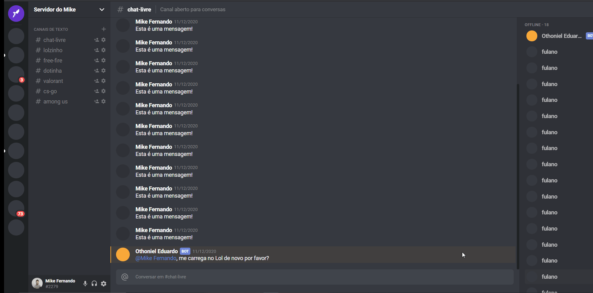

<h1 align="center"> UI Clone Discord </h1>

<h3 align="center"> Aplicação em React reproduzindo a interface do Discord, do zero!. </h3>

  

   

## Tecnologias
- Javascript
- Typescript
- ReactJS
- Styled-components
- Grid
- Flex-box
- CSS
- HTML
